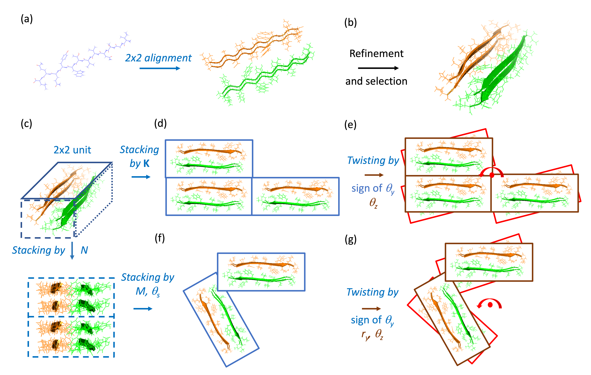
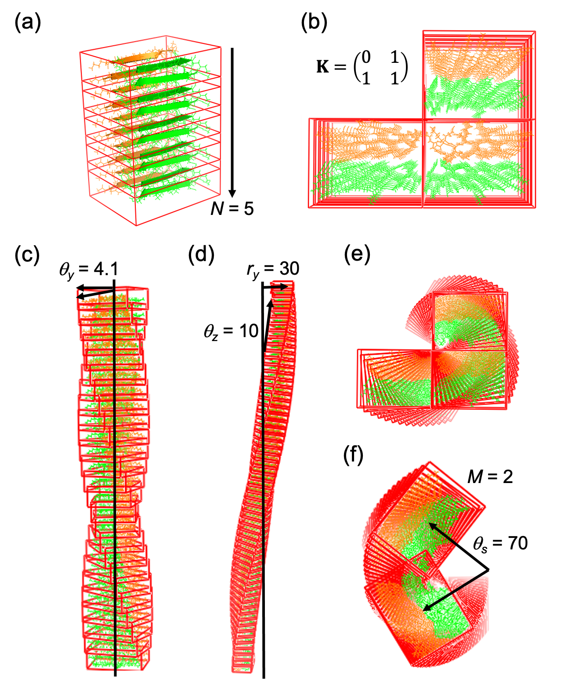
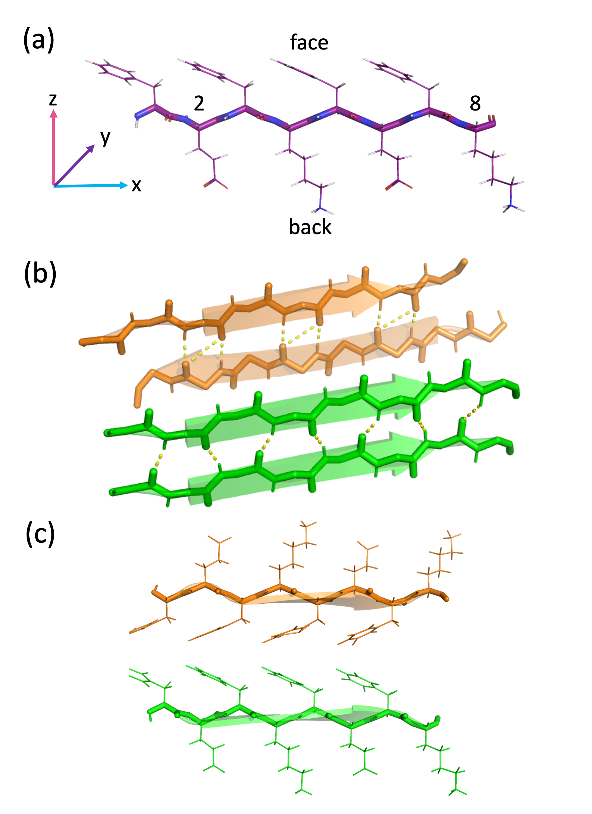
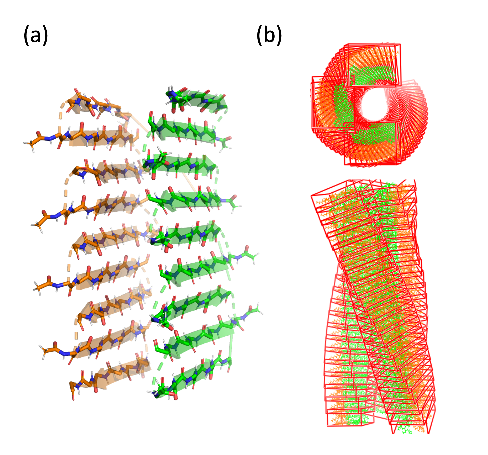
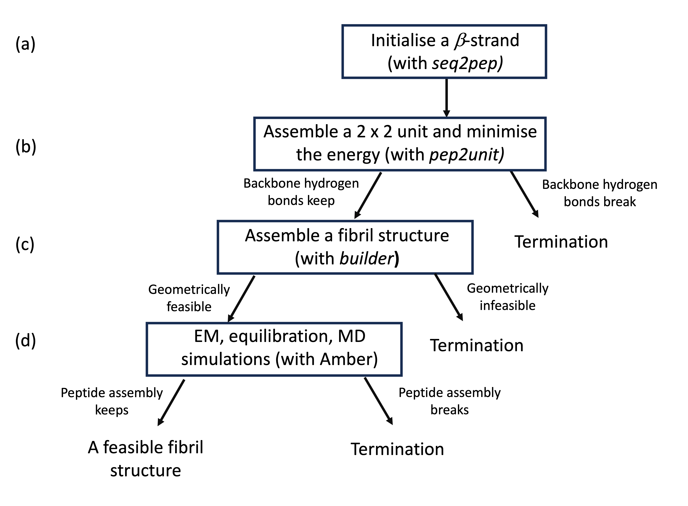

# FibrilGen-v1
Engineering cross-beta nanofibril morphologies and physicochemical properties is attractive for many biomedical applications, such as cell culture and controlled drug release. However, rational design of cross-beta structures is often challenging because peptide assembly varies and crystallised conditions for obtaining high-resolution cryogenic electron microscopy (cryo-EM) and solid-state nuclear magnetic resonance data are limited. It is worth exploring how computational tools can accelerate investigations into the structural basis and morphological variations of cross-beta nanofibrils.

FibrilGen is a Python library for constructing various cross-beta structures using controllable parameters. These structures can be built to fit experimental observations (e.g., cryo-EM or ssNMR data) or be fully hypothetical. A FibrilGen/MD workflow can screen geometrically feasible and energetically favourable cross-beta structures. 

FibrilGen project is maintained with updated versions:

1. [FibrilGen-v0](https://github.com/ChaoYuYang0/FibrilGen-v0) is the first GitHub repository based on our paper FibrilGen: A Python Package for Atomistic Modeling of Peptide β‑Sheet Nanostructures $^{1}$.

2. This version, “FibrilGen-v1”, includes a Python script for side-chain optimisation $^{2}$, a Python script that converts peptide sequences to beta-strands, and structure generation without the PyMOL interface (e.g., in the terminal or in Google Colab).



Figure 1. FibrilGen modelling of cross-beta structures. (a) A 2 x 2 alignment of a beta-strand. (b) A refinement of sidechain orientation (e.g., by energy minimization) (c) Vertical stacking of a 2 x 2 building block, where $N$ is the number of units along the vertical axis. (d) Horizontal stacking of the basic unit, where **K** is a binary matrix of $k_1$ x $k_2$ that assigns the present of units in $k_1$ rows and $k_2$ columns. (e) Vertical twisting of the basic unit, where $\theta_z$ is the tilt angle from the vertical axis, $\theta_y$ is the twist angle around the vertical axis. The sign of $\theta_y$ is 1 for left-handed chirality and -1 for right-handed chirality. (f) Horizontal stacking of the basic unit, where $\theta_s$ is the angular displacement and $M$ is the number of units displaced by $0$, $\theta_s$, ..., $(M-1)\theta_s$. (g) Vertical twisting of the basic unit, where $r_y$ is the radius displaced from the vertical axis. FibrilGen automatically adjusts the twist parameters $\theta_y$, $\theta_z$, and $r_y$ to ensure the assembled structure is compact and non-intersecting. 

## Library functions
FibrilGen has six functions in the "fibril" class. Input parameters required for each function are described below.
1. fibril.build_a_flat_sheet ( $N$ ). The function “build_a_flat_sheet” takes only one parameter, $N$, to specify the repeat of the 2 x 2 unit along the beta-sheet axis.
2. fibril.build_a_stacked_sheet ( **K**, $N$ ). The function “build_a_stacked_sheet” takes $N$ and **K** as input to stack the 2 x 2 units along the fibril long axis and across the fibril cross-section, respectively.
3. fibril.build_a_rod( $\theta_z$, $N$, the sign of $\theta_y$ ). The function “build_a_rod” takes an input parameter $N$ to stack the 2 x 2 units along the beta-sheet axis. An initial helical twist is assigned with a tilt angle $\theta_z$ and the direction (assigned to 1 or -1) of the twist angle $\theta_y$.
4. fibril.build_a_stacked_rod( $\theta_z$, **K**, $N$, the sign of $\theta_y$ ). The function “build_a_stacked_rod” takes $N$ and **K** as input parameters for a linear stacking of the 2 x 2 unit along the fibril long axis and across the fibril cross-section. An initial helical twist is assigned with a tilt angle theta_z and the direction (assigned as 1 or -1) of the twist angle $\theta_y$.
5. fibril.build_a_ribbon( $\theta_z$, $r_y$, $N$, the sign of $\theta_y$ ). The function “build_a_ribbon” takes an input parameter $N$ to stack the 2 x 2 units along the fibril long axis. An initial helical twist is assigned with a tilt angle $\theta_z$, a radius $r_y$, and the direction (assigned as 1 or -1) of the twist angle $\theta_y$.
6. fibril.build_a_stacked_ribbon( $\theta_z$, $r_y$, $\theta_s$, $M$, $N$, the sign of $\theta_y$ ). The function “build_a_stacked_ribbon” takes the input parameter $N$ to stack the 2 x 2 units along the fibril long axis. It assigns rotational stacking on the fibril cross-section, with an incremental rotation angle theta_s repeated $M$ times. An initial helical twist is assigned with a tilt angle $\theta_z$, a radius $r_y$, and the direction (assigned as 1 or -1) of the twist angle $\theta_y$. Here tube is a special case that $\theta_s M=360°$.

## Requirement of external Python libraries $^{3,4,5}$
```bash
# Install PyMOL
conda install -c conda-forge pymol-open-source
# Install OpenBabel
conda install conda-forge::openbabel
```
## PyMOL structure visualisation
Users can import the FibrilGen library into PyMOL to generate and visualise fibril structures. Compatible PyMOL versions include v2.3.5 (commercial), v1.7.4.5 (educational), and v2.3.0 (open-source).

## Generate example structures in PyMOL
### 1. Import FibrilGen library
```bash
# Change the current directory to FibrilGen
cd [directory of FibrilGen]
# Import FibrilGen library 
run builder.py
```
### 2. Build FibrilGen structures
```bash
# Demonstrate building a beta-sheet structure
example('a_sheet')
# Demonstrate building a stacked beta-sheet structure
example('s_sheet')
# Demonstrate building a rod structure
example('a_rod')
# Demonstrate building a stacked rod structure
example('s_rod')
# Demonstrate building a ribbon structure
example('a_ribbon')
#  Demonstrate building a stacked ribbon structure
example('s_ribbon')
```
### 3. Output structures



Figure 2. Output structures after calling (a) example('a_sheet'), (b) example('s_sheet'), (c) example('a_rod'), (d) example('a_ribbon'), (e) example('s_rod'), or (f) example('s_ribbon').

## Generate new building blocks in PyMOL
### 1. Modify scripts/pep_init.py to initialise a beta-strand
```bash
# Import seq2pep library
pymol.cmd.run('seq2pep.py')
# Initialise a beta-strand
get_b_strand('FEFKFEFK')
# Align bulky residues on the beta-sheet cross-section
set_chi_angle(1,'n','ca','cb','cg',-20)
set_chi_angle(3,'n','ca','cb','cg',-20)
set_chi_angle(5,'n','ca','cb','cg',-20)
set_chi_angle(7,'n','ca','cb','cg',-20)
```
### 2. Execute pep_init.py in the command line
```bash
run scripts/pep_init.py
```
### 3. Modify scripts/bilayer_init.py to initialise a bilayer beta-sheet structure
```bash
# Import pep2unit library
pymol.cmd.run('pep2unit.py')
# Create a periodic unit
unit = create_pep_unit('pep',2,8,0) # INPUT: (peptide, start residue index, end residue index, does the start residue locate at the face)
# Create a sheet object
sheet = create_sheet(unit)
# Build a bilayer structure
sheet.build_a_plain_sheet('ppa',1,5) # INPUT: (peptide alignment aaa/apa/aap/app/paa/ppa/pap/ppp, does two beta-sheet aligned face-to-face, num of units per sheet)
# Import openbabel and optimisation library
pymol.cmd.run('optimize.py')
# Remove steric clashes
minimize('plain_sheet',nsteps0=100)
```
### 4. Execute bilayer_init.py in the command line
```bash
run scripts/bilayer_init.py
```
### 5. Output structures



Figure 3. Build a bilayer structure. (a) Select a linear segment (e.g., start residue index 2 and end residue index 8) and assign the face side for the segment (assign 1 for the start residue at the face side and 0 for the start residue at the back side). (b) Assign the backbone alignment by the intra-sheet backbone alignment of the inner sheet, the inter-sheet backbone alignment of the first beta-strand in the inner sheet and the first beta-strand in the outer sheet, and the intra-sheet backbone alignment of the outer sheet (e.g., "ppa" stands for the inner parallel sheet and the outer antiparallel sheet aligned parallelly). For visualisation, green labels the inner sheet, and orange labels the outer sheet. (c) Assign the outer sheet alignment face as 1 for face-to-face alignment (as shown) and 0 for face-to-back alignment. 

## Generate new fibril structures in PyMOL
### 1. Modify scripts/fibril_init.py to initialise a cross-beta nanostructure
```bash
# Import FibrilGen library
pymol.cmd.run('builder.py')
# Load a bilayer structure
pymol.cmd.load('structures/input/capF8_bilayer.pdb')
# Create a periodic unit
unit = create_sheet_unit(10,9,2,9) # INPUT: (peptide length, the number of peptides per sheet, start residue index, end residue index)
# Create a fibril object
fibril = create_fibril(unit)
# Build a cross-beta structure (e.g., a ribbon)
fibril.build_a_stacked_ribbon(10,30,90,3,20,1) # INPUT: (tilt angle, radius, stacking angle, stacking number, num of units per sheet, twist sign)
```
### 2. Execute fibril_init.py in the command line
```bash
run scripts/fibril_init.py
```
### 3. Output structures



Figure 4. Build a cross-beta structure. (a) Assign parameters for the reference bilayer structure. In this example bilayer structure, nine 10-mer peptides are assembled for each beta-sheet, and the segment for backbone alignment starts from residue index 2 to 9. (b) Assign parameters for generating a fibril structure. In this example ribbon structure, the units are stacked on the fibril cross-section ($\theta_s=90$, $M=3$) and along the fibril axis ($N=20$). The fibril is assigned a left-handed twist (the sign of $\theta_y$ equals 1). The assigned initial helical twist ($\theta_z=10$, $r_y=30$) is automatically refined to avoid steric clashes.

## Generate new structures from your terminal (instead of PyMOL)
You can use FibrilGen for large-scale structure generation or virtual screening. 
```bash
# Change the current directory to your script
cd [directory of FibrilGen]/scripts/by_terminal/
# Build a beta-strand structure
python3 pep_init.py
# Build a bilayer structure
python3 bilayer_init.py
# Build a fibril structure
python3 fibril_init.py
```

## Generate new structures from your Google Colab (instead of PyMOL)
You can use FibrilGen in a Jupyter notebook to demonstrate hypothetical cross-beta structures and their fibril morphologies. For an example file, please refer to [directory of FibrilGen]/demo/Google_Colab/my_first_demo.ipynb

## Applications
### 1. Reconstruction/ generation of compact fibril structures
Users can use experimental observations and FibrilGen to build a cross-beta fibril at the atomic level. A combined analysis of high-resolution cryo-EM and ssNMR data can potentially determine the basic 2 x 2 alignment (Figure 1a), the stacking pattern on the fibril cross-section (Figure 1d or 1f), and the fibril helical twist (Figure 1e or 1g).

Users can use FibrilGen to generate a hypothetical fibril structure for a given peptide molecule. As illustrated in Figure 1, FibrilGen constructs a conformational space where the choice of peptide alignment (parallel or antiparallel) in the 2 x 2 unit is discrete; the parameter space ( **K**, $M$, $\theta_s$ ) for the stacking on the fibril cross-section is discrete; and the parameter space ( $r_y$, $\theta_y$, $\theta_z$ ) for the helical twist of the fibril is continuous. When assigning the 2 × 2 unit with the stacking parameters ( **K**, $M$, $\theta_s$ ), the feasible helical twists for a compact assembly are constrained. To obtain a feasible fibril structure, FibrilGen takes an initial helical twist ( $r_y$, the sign of $\theta_y$, $\theta_z$ ) as input and iteratively refines it into a compact, non-overlapping fibril structure.


### 2. Thermodynamic stability assessment of hypothetical fibril structures



Figure 5. FibrilGen/MD workflow for hypothesising fibril structures. (a) Initialise a beta-strand (manual adjustment for unnatural amino acids). (b) Assemble 2 x 2 units and minimise the energy. (c) If the 2 x 2 units can be energy-minimised without losing backbone hydrogen bonds, then assemble an optimised 2 x 2 unit into a fibril structure. (d) For a geometrically feasible fibril structure, assess whether the structure can be energy-minimised and equilibrated without losing the combined assembly, and then assess whether the overall structure is stable in molecular dynamics simulation.

Pre-assembled backbone hydrogen bonding and side-chain packing are critical to maintaining the fibril structure (in solvent) over a long molecular dynamics simulation. It is reasonable to confirm that an energy-minimised 2 × 2 unit has valid inter-peptide backbone hydrogen bonds and side-chain packing (Figure 5b). If the 2 × 2 unit is stable, we ask whether it can assemble into the target fibril geometry (Figure 5c), and then whether the fibril structure is thermodynamically stable in molecular dynamics simulation (Figure 5d). To enhance structure stability during heating equilibration, we suggest applying a constraint potential between the central $C_\alpha$ atoms of consecutive beta-strands. A restraint file for the Amber molecular dynamics package, under option nmropt=1, is exemplified in demo/FibrilGen-MD/write_restraint.py

## Acknowledgements
The author thank Prof. Alberto Saiani, Prof. Aline Miller and Prof. Richard Bryce for their support; Prof. Sarah Harris, Prof. Sam Hay, and Dr Jas Kalayan for insightful discussions.

## Contact information
Any feedback, comments, and suggestions are welcome. Please use GitHub issues or email Chao-Yu Yang at cherryyang0215@gmail.com.

## License
The code is free for non-commercial use. You are welcome to use the code and documents, but please refer to the original work.

## References
$^1$ Chao-Yu Yang, Aline F. Miller, Alberto Saiani, Richard A. Bryce. FibrilGen: a Python package for atomistic modelling of peptide b-sheet nanostructures, JCIM, (2025). DOI: [10.1021/acs.jcim.5c02108](https://doi.org/10.1021/acs.jcim.5c02108).

$^2$ Osvaldo Martin, Molecular optimisation Python library, http://www.pymolwiki.org/index.php/optimize.

$^3$ The PyMOL Molecular Graphics System, Version 3.2.0, Schrödinger, LLC, 2026.

$^4$ N M O'Boyle, M Banck, C A James, C Morley, T Vandermeersch, and G R Hutchison. "Open Babel: An open chemical toolbox." J. Cheminf. (2011), 3, 33. DOI: [10.1186/1758-2946-3-33](https://link.springer.com/article/10.1186/1758-2946-3-33).

$^5$ The Open Babel Package, version 3.2.1, https://openbabel.org/.


